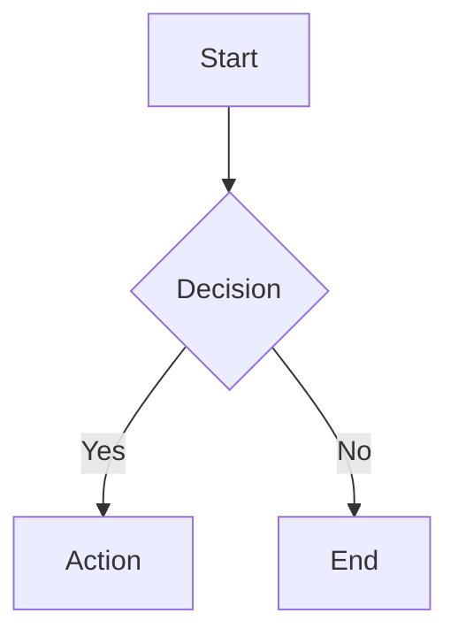

# Ark Lens

Secure, offline-first Markdown and HTML viewer for Visual Studio Code.

Renders `.md` and `.html` files in a side panel with Mermaid diagrams, Chart.js charts, syntax highlighting, and full readability controls -- without any network requests or code execution.

## Features

- **Markdown rendering** -- GFM tables, task lists, footnotes, blockquotes, definition lists, details/summary
- **Mermaid diagrams** -- Flowcharts, sequence diagrams, gantt charts, rendered offline with strict security
- **Chart.js charts** -- Bar, line, pie, doughnut charts from JSON code blocks
- **Syntax highlighting** -- 20 languages via Prism.js (TypeScript, Python, Go, Rust, Bash, SQL, and more)
- **HTML file viewing** -- Standalone `.html` files rendered with DOMPurify sanitisation
- **Tabbed interface** -- Open multiple files in tabs within one panel, LRU eviction when limit is reached
- **Dark/light themes** -- Auto-follows VS Code theme, or toggle manually
- **Readability controls** -- Font size (12-24px), font family (sans/serif/mono), content width (narrow/medium/wide)
- **Table of contents** -- Auto-generated sidebar from document headings with scroll tracking
- **Auto-refresh** -- Preview updates as you type (300ms debounce)

## Usage

### Opening a preview

| Method | Action |
|--------|--------|
| Keyboard | `Ctrl+Shift+L` (with a `.md` or `.html` file open) |
| Command Palette | `Ctrl+Shift+P` then type "Ark Lens: Open Ark Preview" |
| Right-click (editor) | Right-click in an open Markdown or HTML file |
| Right-click (explorer) | Right-click a `.md` or `.html` file in the file explorer |
| Editor title bar | Click the Ark Lens icon in the top-right of the editor |

### Charts in Markdown

Use a fenced code block with language `chart`, `chartjs`, or `chart-js`:

````markdown
```chart
{
  "type": "bar",
  "data": {
    "labels": ["Jan", "Feb", "Mar"],
    "datasets": [{ "label": "Sales", "data": [10, 20, 30] }]
  }
}
```
````

### Mermaid diagrams

Use a fenced code block with language `mermaid`:

````markdown

````

## Settings

| Setting | Default | Description |
|---------|---------|-------------|
| `arkLens.theme` | `auto` | Theme: `auto`, `light`, or `dark` |
| `arkLens.fontSize` | `16` | Font size in pixels (12-24) |
| `arkLens.fontFamily` | `system` | Font: `system`, `serif`, or `mono` |
| `arkLens.contentWidth` | `medium` | Width: `narrow` (600px), `medium` (800px), `wide` (full) |
| `arkLens.tocVisible` | `true` | Show table of contents sidebar |
| `arkLens.maxTabs` | `10` | Maximum open tabs before oldest is closed |

## Security

Ark Lens is designed with a zero-trust security model:

- **No network access** -- `connect-src 'none'` in Content Security Policy. The extension makes zero outbound requests. No CDN, no telemetry, no analytics.
- **No code execution** -- No `eval()`, `new Function()`, or inline scripts. All scripts loaded via CSP nonce.
- **HTML sanitisation** -- All rendered content passes through DOMPurify before DOM insertion, including Mermaid SVG output.
- **Strict CSP** -- `default-src 'none'` baseline with nonce-based script loading and scoped resource roots.
- **Offline-only** -- All rendering libraries (Mermaid, Chart.js, Prism.js, markdown-it, DOMPurify) are bundled in the extension. Nothing is fetched at runtime.

### What is blocked

- `<script>`, `<iframe>`, `<object>`, `<embed>`, `<form>` tags
- `<style>`, `<base>`, `<foreignObject>`, `<canvas>` tags
- All `on*` event handler attributes (`onerror`, `onclick`, etc.)
- Inline `style` attributes
- External network requests of any kind

## Requirements

- Visual Studio Code 1.85 or later
- No additional dependencies required

## Installation

### From VSIX (local)

```bash
code --install-extension ark-lens-0.1.0.vsix
```

### From source

```bash
git clone <repository-url>
cd ark-lens
npm install
npm run build
npm run package
code --install-extension ark-lens-0.1.0.vsix
```

## Known Limitations

- **Inline styles in CSP** -- `'unsafe-inline'` is allowed for `style-src` because Chart.js and Mermaid require it. DOMPurify blocks `<style>` tags to compensate.
- **No live preview for unsaved files** -- The extension previews the saved document content.
- **Large Mermaid diagrams** -- Very complex diagrams may take a moment to render.
- **Chart.js callbacks** -- Only JSON configuration is supported. JavaScript callback functions in chart configs are not executed (by design).

## Disclaimer

This extension is provided "as is" without warranty of any kind, express or implied. While security is a primary design goal, no software is guaranteed to be free of vulnerabilities. The extension processes untrusted file content in a sandboxed VS Code webview with strict Content Security Policy -- however, users should exercise standard caution when opening files from untrusted sources.

The authors are not liable for any damages arising from the use of this extension. Use at your own discretion.

## License

MIT
