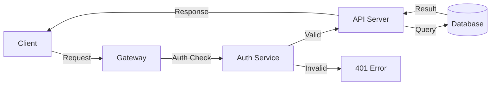

# API Reference

## Authentication

All requests require a Bearer token in the `Authorization` header.

```bash
curl -H "Authorization: Bearer $TOKEN" https://api.example.com/v1/resources
```

## Endpoints

### GET /resources

Returns a list of resources.

```json
{
  "data": [
    { "id": 1, "name": "Alpha", "status": "active" },
    { "id": 2, "name": "Bravo", "status": "inactive" }
  ],
  "meta": { "total": 2, "page": 1 }
}
```

### POST /resources

Create a new resource.

```typescript
interface CreateResourceRequest {
  name: string;
  description?: string;
  tags: string[];
}

async function createResource(body: CreateResourceRequest): Promise<Resource> {
  const res = await fetch('/api/v1/resources', {
    method: 'POST',
    headers: { 'Content-Type': 'application/json' },
    body: JSON.stringify(body),
  });
  return res.json();
}
```

## Rate Limits

| Tier | Requests/min | Burst |
|------|-------------|-------|
| Free | 60 | 10 |
| Pro | 600 | 100 |
| Enterprise | 6000 | 1000 |

## Error Codes

| Code | Meaning |
|------|---------|
| 400 | Bad Request -- malformed input |
| 401 | Unauthorized -- invalid or missing token |
| 403 | Forbidden -- insufficient permissions |
| 404 | Not Found -- resource does not exist |
| 429 | Too Many Requests -- rate limit exceeded |
| 500 | Internal Server Error |

## Flowchart



---

*Auto-generated API documentation*
