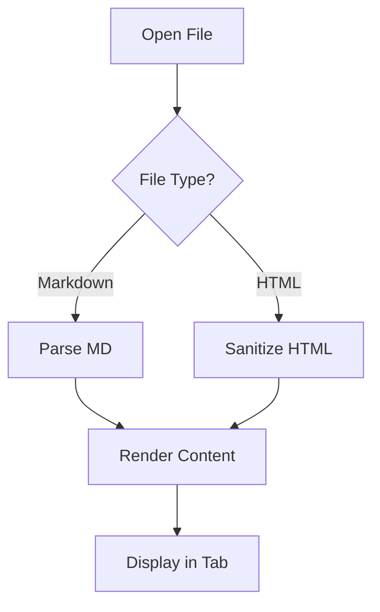
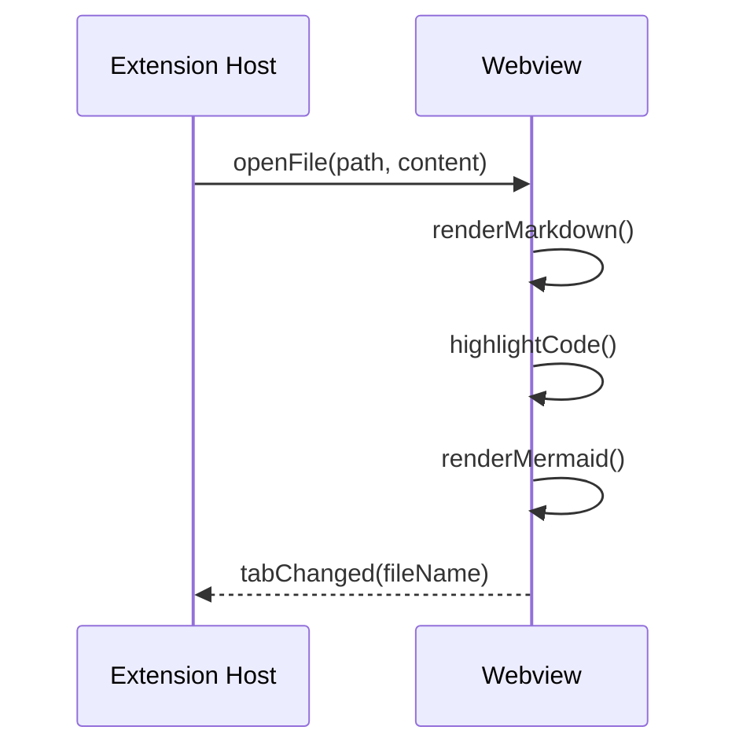

# Ark Lens Feature Demo

This file tests all rendering features.

## Code Highlighting

### TypeScript

```typescript
interface Config {
  theme: 'light' | 'dark' | 'auto';
  fontSize: number;
}

function greet(name: string): string {
  return `Hello, ${name}!`;
}
```

### Python

```python
from pathlib import Path

def process_files(directory: Path) -> list[str]:
    """Process all markdown files in directory."""
    return [f.name for f in directory.glob("*.md")]
```

### Bash

```bash
#!/bin/bash
for file in *.md; do
  echo "Processing: $file"
  wc -l "$file"
done
```

## Mermaid Diagrams

### Flowchart



### Sequence Diagram



## Chart.js

```chart
{
  "type": "bar",
  "data": {
    "labels": ["Jan", "Feb", "Mar", "Apr", "May"],
    "datasets": [{
      "label": "Downloads",
      "data": [120, 190, 300, 250, 420],
      "backgroundColor": ["#f38ba8", "#fab387", "#f9e2af", "#a6e3a1", "#89b4fa"]
    }]
  }
}
```

## Tables

| Feature | Status | Priority |
|---------|--------|----------|
| Markdown rendering | Done | High |
| Syntax highlighting | Done | High |
| Mermaid diagrams | Done | Medium |
| Chart.js charts | Done | Medium |
| Theme toggle | Done | High |
| TOC sidebar | Done | Medium |
| Tab management | Done | High |

## Blockquotes

> This is a blockquote.
> It can span multiple lines.

## Task Lists

- [x] Set up project scaffold
- [x] Implement markdown pipeline
- [x] Add syntax highlighting
- [x] Add Mermaid support
- [ ] Package as VSIX
- [ ] Publish to marketplace

## Links and Formatting

**Bold text**, *italic text*, ~~strikethrough~~, `inline code`

[VS Code Docs](https://code.visualstudio.com/docs)

## Horizontal Rule

---

## Details/Summary

<details>
<summary>Click to expand</summary>

This content is hidden by default but can be revealed by clicking the summary.

- Item one
- Item two
- Item three

</details>

## Keyboard Shortcuts

Press <kbd>Ctrl</kbd>+<kbd>Shift</kbd>+<kbd>L</kbd> to open Ark Lens.

## Math-like Content

The formula `E = mc^2` is well known. Here is a code block showing math:

```
f(x) = ax^2 + bx + c
g(x) = integral(f(t), t, 0, x)
```

## Nested Lists

1. First level
   - Second level A
   - Second level B
     1. Third level ordered
     2. Another third level
   - Back to second
2. Back to first

## Definition List

<dl>
<dt>Ark Lens</dt>
<dd>A secure, offline-first VS Code extension for rendering Markdown and HTML files.</dd>

<dt>CSP</dt>
<dd>Content Security Policy - restricts resources the webview can load.</dd>

<dt>DOMPurify</dt>
<dd>A DOM-only XSS sanitizer for HTML, MathML and SVG.</dd>
</dl>

---

*End of demo file*
